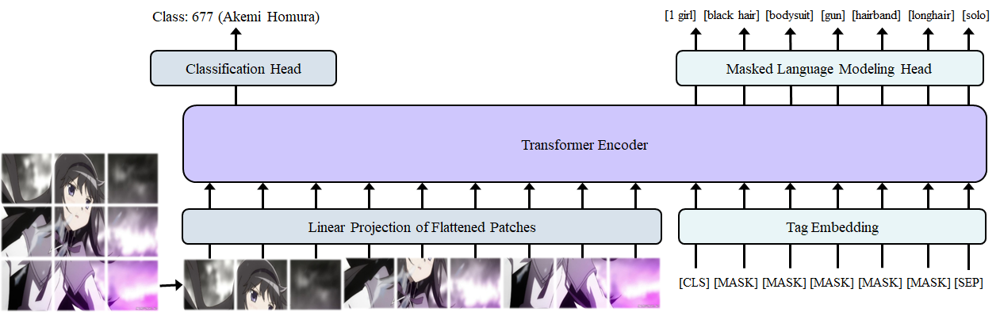

# Overview 
Anime character recognition and tagging using PyTorch.

Our best vision-only model, ViT L-16 with image size 128x128 and batch size 16 achieves to get 89.71% 
and 96.14% test set top-1 and top-5 classification accuracies, respectively, among 3263 characters!

We hope that this work inspires other researchers to follow and build upon this path. 

Checkpoints and data: [Google Drive](https://drive.google.com/drive/folders/1Tk2e5OoI4mtVBdmjMhfoh2VC-lzW164Q?usp=sharing).

# Features
* Variety of architectures to choose from: Shallow, Resnet18/50/152, EfficientNet-B0, Vi(L)T B-16/B-32/L-16/L-32
* Two fully-fledged datasets, moeImouto and DAF:re, with 173 and more than 3000 classes, respectively
* Pre-trained models for best performing models using image size of 128x128.
* Supporting scripts for making, visualization and stats for datasets.
* Scripts for training from scratch, evaluation (accuracy of a model with a certain set and pretrained weights), and inference (classifies all images in a given (`test_images` by default) folder.
 
# How to (summary)

## Training
Train a ViT B-16 vision only model with intermediate features aggregation classification head on DanbooruFaces for recognition: 
`python train.py --dataset_name danbooruFaces --dataset_path YOUR_PATH --model_name B_16 --image_size 128 --batch_size 64 --learning_rate_scheduler warmupCosine --pretrained --interm_features`

Train a ViLT B-16 with tag/language tokens on DanbooruFull for recognition: 
`python train.py --dataset_name danbooruFull --dataset_path YOUR_PATH --model_name B_16 --image_size 128 --batch_size 64 --learning_rate_scheduler warmupCosine --pretrained --multimodal --max_text_seq_len 32 --tokenizer wp`

Train a ViLT B-16 with tag/language tokens on DanbooruFull for recognition and tagging: 
`python train.py --dataset_name danbooruFull --dataset_path YOUR_PATH --model_name B_16 --image_size 128 --batch_size 16 --learning_rate_scheduler warmupCosine --pretrained --multimodal --max_text_seq_len 16 --tokenizer tag --mask_schedule full --masking_behavior constant`

## Inference
Load pretrained model for recognition (defaults: B-16, IS=128):
`python inference.py --dataset_path YOUR_PATH --checkpoint_path PATH_TO_CHECKPOINT`

Load pretrained model for recognition and tagging (defaults: B-16, max_text_seq_len=16, tokenizer='tag'):
`python inference.py --dataset_path YOUR_PATH --checkpoint_path PATH_TO_CHECKPOINT --mode recognition_tagging`

# How to use (detailed)
The main scripts in this repo are the `train.py`, `evaluate.py` and `inference.py`.
 
## train.py
 
This script takes as input a set of hyperparameters (dataset to use, model, batch and image size, 
among others) and trains the model, either from scratch, or from a checkpoint. 
If training from a checkpoint, it can also use it to do knowledge transfer between datasets, 
by for example using a checkpoint trained on *DAF:re* to classify images according to the characters in *moeImouto*. 
It can also train a model based on both images and tags data.
```
usage: train.py [-h]
                [--dataset_name {moeImouto,danbooruFaces,cartoonFace,danbooruFull}]
                [--dataset_path DATASET_PATH]
                [--model_name {shallow,resnet18,resnet50,resnet152,efficientnetb0,B_16,B_32,L_16,L_32}]
                [--results_dir RESULTS_DIR] [--image_size IMAGE_SIZE]
                [--batch_size BATCH_SIZE] [--no_epochs NO_EPOCHS]
                [--learning_rate LEARNING_RATE]
                [--lr_scheduler {warmupCosine,epochDecayConstant}]
                [--epoch_decay EPOCH_DECAY] [--warmup_steps WARMUP_STEPS]
                [--pretrained] [--checkpoint_path CHECKPOINT_PATH]
                [--transfer_learning]
                [--load_partial_mode {full_tokenizer,patchprojection,posembeddings,clstoken,patchandposembeddings,patchandclstoken,posembeddingsandclstoken,None}]
                [--log_freq LOG_FREQ]
                [--save_checkpoint_freq SAVE_CHECKPOINT_FREQ]
                [--no_cpu_workers NO_CPU_WORKERS] [--seed SEED]
                [--interm_features_fc] [--debugging]
                [--max_text_seq_len MAX_TEXT_SEQ_LEN]
                [--mask_schedule {None,bert,full,sigmoid}]
                [--mask_wu_percent MASK_WU_PERCENT]
                [--mask_cd_percent MASK_CD_PERCENT] [--ret_attn_scores]
                [--tokenizer {wp,tag}] [--masking_behavior {constant,random}]
                [--shuffle_tokens]

optional arguments:
  -h, --help            show this help message and exit
  --dataset_name {moeImouto,danbooruFaces,cartoonFace,danbooruFull}
                        Which dataset to use.
  --dataset_path DATASET_PATH
                        Path for the dataset.
  --model_name {shallow,resnet18,resnet50,resnet152,efficientnetb0,B_16,B_32,L_16,L_32}
                        Which model architecture to use
  --results_dir RESULTS_DIR
                        The directory where results will be stored
  --image_size IMAGE_SIZE
                        Image (square) resolution size
  --batch_size BATCH_SIZE
                        Batch size for train/val/test.
  --no_epochs NO_EPOCHS
                        Total number of epochs for training.
  --learning_rate LEARNING_RATE
                        Initial learning rate.
  --lr_scheduler {warmupCosine,epochDecayConstant}
                        LR scheduler.
  --epoch_decay EPOCH_DECAY
                        After how many epochs to decay the learning rate once.
  --warmup_steps WARMUP_STEPS
                        Warmup steps for LR scheduler.
  --pretrained          For models with pretrained weights
                        availableDefault=False
  --checkpoint_path CHECKPOINT_PATH
  --transfer_learning   Load partial state dict for transfer learningResets
                        the [embeddings, logits and] fc layer for ViTResets
                        the fc layer for ResnetsDefault=False
  --load_partial_mode {full_tokenizer,patchprojection,posembeddings,clstoken,patchandposembeddings,patchandclstoken,posembeddingsandclstoken,None}
                        Load pre-processing components to speed up training
  --log_freq LOG_FREQ   Frequency in steps to print results (and save images
                        if needed).
  --save_checkpoint_freq SAVE_CHECKPOINT_FREQ
                        Frequency (in epochs) to save checkpoints
  --no_cpu_workers NO_CPU_WORKERS
                        CPU workers for data loading.
  --seed SEED           random seed for initialization
  --interm_features_fc  If use this flag creates FC using intermediate
                        features instead of only last layer.
  --debugging           If use this flag then shortens the training/val loops
                        to log_freq*3.
  --multimodal          Vision+tags if true
  --max_text_seq_len MAX_TEXT_SEQ_LEN
                        Length for text sequence (for padding and truncation).
                        Default uses same as image.
  --mask_schedule {None,bert,full,sigmoid}
                        Scheduler for masking language tokens.
  --mask_wu_percent MASK_WU_PERCENT
                        Percentage of training steps for masks warmup
  --mask_cd_percent MASK_CD_PERCENT
                        Percentage of training steps for masks cooldown
  --ret_attn_scores     Returns attention scores for visualization
  --tokenizer {wp,tag}  Tokenize using word-piece (BERT pretrained from HF) or
                        custom tag-level
  --masking_behavior {constant,random}
                        When masked convert token to 1 or to a random int in
                        vocab size
  --shuffle_tokens      When turned on it shuffles tokens before sending to
                        bert or custom tokenizer
```

## inference.py
Same arguments as previous one but also additionally takes mode (recognition_vision for recognition only, and recognition_tagging for doing both),
test_path for the images to test (tests all files in directory), results_infer (where to save), and save_results (save images with visualization of
class probabilities if doing vision ony recognition).

```
usage: inference.py [--mode {recognition_vision,recognition_tagging,generate_tags}] [--test_path TEST_PATH]
                    [--results_infer RESULTS_INFER] [--save_results SAVE_RESULTS]

  --mode {recognition_vision,recognition_tagging,generate_tags}
                        Mode for inference (multimodal or vision).
  --test_path TEST_PATH
                        The directory where test image is stored.
  --results_infer RESULTS_INFER
                        The directory where inference results will be stored.
  --save_results SAVE_RESULTS
                        Save the images after transform and with label results.
```